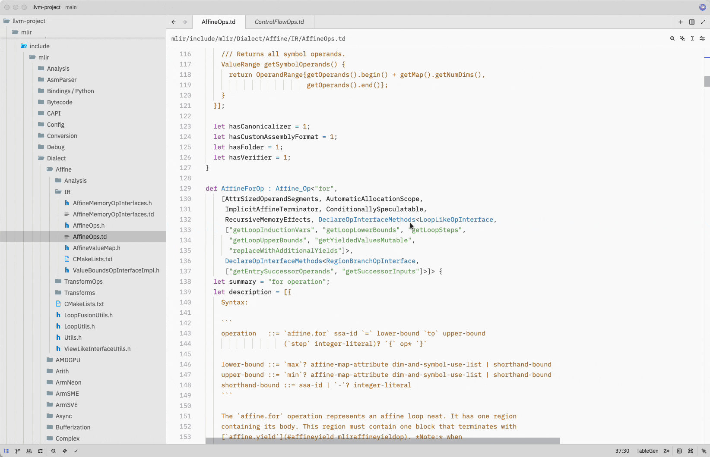
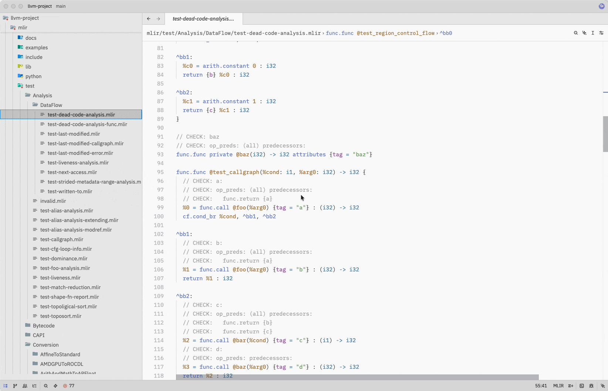
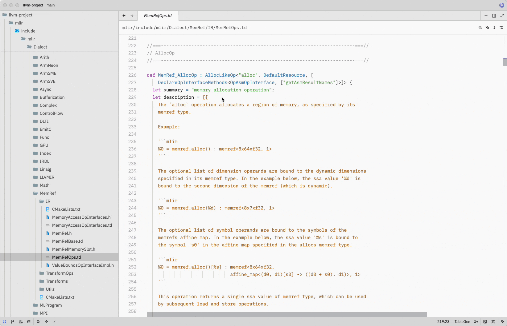
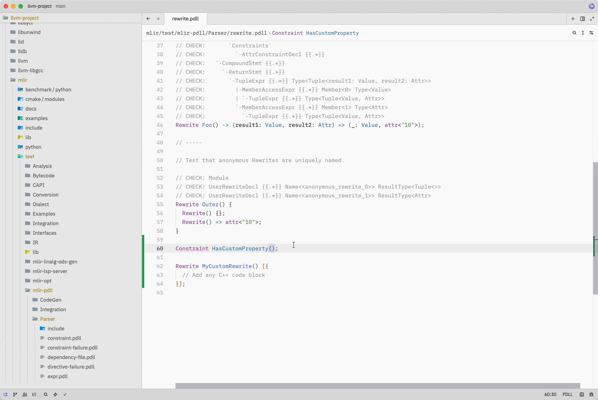
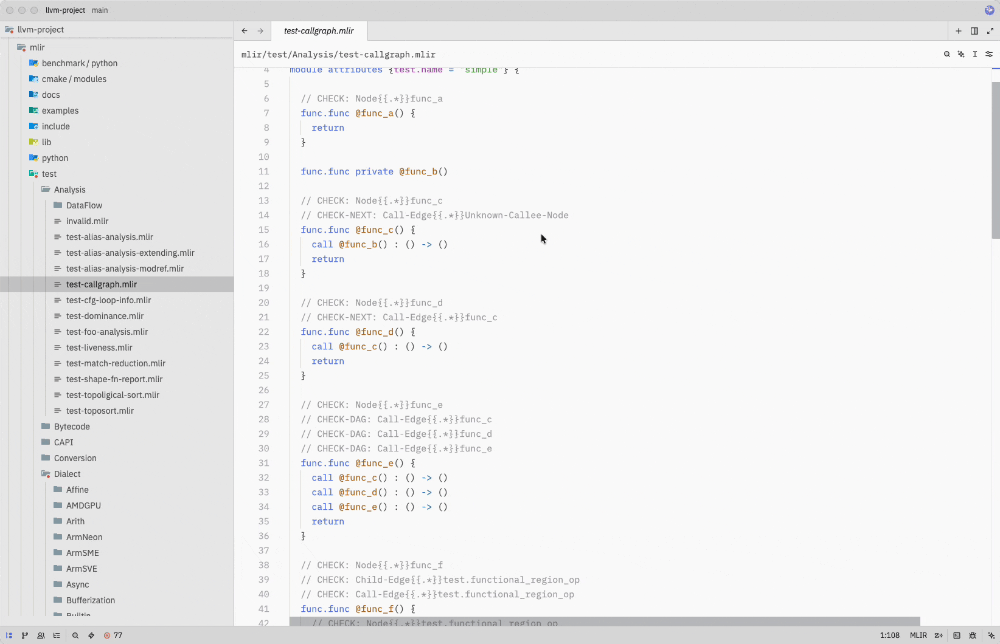

# MLIR Suite

IDE support for [MLIR](https://mlir.llvm.org), TableGen, and PDLL in the [Zed](https://zed.dev) editor.

## Features

- **Tree-sitter grammars** for MLIR (`.mlir`), TableGen (`.td`), and PDLL (`.pdll`) — 100% pass rate on 403 official MLIR test files across 11 core dialects.
- **First-class custom dialect support** — unknown `dialect.op` forms are recognized and highlighted correctly, so your project's own dialects just work.
- **Symbol outline** — navigate `func.func`, modules, block labels, and PDLL `Pattern` / `Constraint` / `Rewrite` declarations from the outline panel.
- **Language Server integration** for all three upstream LLVM servers:
  - `mlir-lsp-server` for `.mlir`
  - `mlir-pdll-lsp-server` for `.pdll`
  - `tblgen-lsp-server` for `.td`
- **Editing ergonomics** — bracket matching, auto-close pairs, and indentation tuned for each language.

## Screenshots

A quick tour of the LSP features in action.

### Go to Definition


### Find References


### Hover / Signature


### Completion


### Diagnostics


### Symbol Outline


## Installation

Install from Zed's Extensions panel (`Cmd+Shift+X` on macOS, `Ctrl+Shift+X` on Linux/Windows), or install as a dev extension:

```bash
git clone https://github.com/felixtensor/zed-mlir.git
```

In Zed, open **Extensions** → **Install Dev Extension** → select the cloned directory.

## Language Server Setup

This extension **does not ship any language server binary**. You bring your own — built from the LLVM project — and the extension locates it for you.

### Building the servers

The three servers live in the `llvm-project` monorepo under `mlir/tools/`. Follow the [official MLIR Getting Started guide](https://mlir.llvm.org/getting_started/) to build them; a typical Unix-like flow is:

```bash
git clone https://github.com/llvm/llvm-project.git
mkdir llvm-project/build && cd llvm-project/build

cmake -G Ninja ../llvm \
  -DLLVM_ENABLE_PROJECTS=mlir \
  -DLLVM_TARGETS_TO_BUILD="Native" \
  -DCMAKE_BUILD_TYPE=Release \
  -DLLVM_ENABLE_ASSERTIONS=ON

cmake --build . --target mlir-lsp-server mlir-pdll-lsp-server tblgen-lsp-server
```

After a successful build, the binaries land in `llvm-project/build/bin/`. Either add that directory to your `$PATH`, or point each server at its absolute path via `settings.json` (see below).

> Tip: if `mlir` is listed in `LLVM_ENABLE_PROJECTS` and you build the default `all` target, the three LSP servers are produced along with the rest of MLIR — no separate invocation needed.

### How the extension finds them

For each language, the extension resolves the server binary in this order:

1. **User setting** — `lsp.<server-id>.binary.path` in your Zed `settings.json`.
2. **PATH lookup** — falls back to searching `$PATH` for the default binary name.

If neither succeeds, you'll see an error that tells you exactly where to set the path or how to install. Syntax highlighting, outline, and other non-LSP features continue to work even when no server is configured.

The three server ids are:

| Language | Server id |
|---|---|
| MLIR | `mlir-lsp-server` |
| PDLL | `mlir-pdll-lsp-server` |
| TableGen | `tblgen-lsp-server` |

### Configuration examples

**Override a binary path** (server installed outside `$PATH`):

```json
{
  "lsp": {
    "mlir-lsp-server": {
      "binary": {
        "path": "/path/to/llvm-project/build/bin/mlir-lsp-server"
      }
    }
  }
}
```

**Point PDLL at a compilation database** (enables cross-file navigation for included `.td` / `.pdll` files):

```json
{
  "lsp": {
    "mlir-pdll-lsp-server": {
      "binary": {
        "path": "/path/to/llvm-project/build/bin/mlir-pdll-lsp-server",
        "arguments": [
          "--pdll-compilation-database=/path/to/build/pdll_compile_commands.yml",
          "--pdll-extra-dir=/path/to/llvm-project/mlir/include"
        ]
      }
    }
  }
}
```

**Point TableGen at include directories** (needed for `include "mlir/..."` resolution, go-to-definition, completion):

```json
{
  "lsp": {
    "tblgen-lsp-server": {
      "binary": {
        "path": "/path/to/llvm-project/build/bin/tblgen-lsp-server",
        "arguments": [
          "--tablegen-compilation-database=/path/to/build/tablegen_compile_commands.yml",
          "--tablegen-extra-dir=/path/to/llvm-project/llvm/include",
          "--tablegen-extra-dir=/path/to/llvm-project/mlir/include"
        ]
      }
    }
  }
}
```

> **Important — include paths are required for a usable TableGen LSP.** Without `--tablegen-extra-dir` (or a `--tablegen-compilation-database`), `tblgen-lsp-server` can't resolve `include "mlir/..."` / `include "llvm/..."` directives, which means go-to-definition and completion will silently fail on most symbols. This is a requirement of the server, not a limitation of this extension. PDLL has an equivalent requirement: pass `--pdll-compilation-database` or `--pdll-extra-dir` for cross-file navigation.

**Enable verbose LSP logging** (for debugging — all three servers accept `--log={error|info|verbose}`):

```json
{
  "lsp": {
    "mlir-lsp-server": {
      "binary": {
        "arguments": ["--log=verbose"]
      }
    }
  }
}
```

After changing settings, open the command palette and run `zed: restart language server` to apply them.

## Feedback & Contributions

This extension is actively developed. See the [roadmap](docs/ROADMAP.md) for what's planned next. Bug reports, feature requests, and pull requests are welcome:

- [Open an issue](https://github.com/felixtensor/zed-mlir/issues)
- Submit a pull request with your improvements

## License

Apache License 2.0 with LLVM Exceptions.
